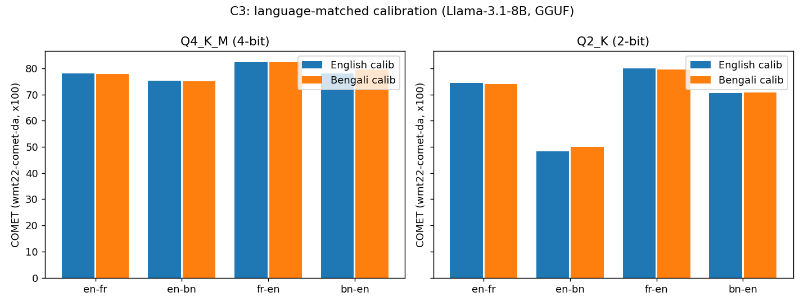

# Replication — *The Uneven Impact of Post-Training Quantization in Machine Translation*

Independent replication of **arXiv:2508.20893** (Marie & Fujita, NICT, Aug 2025 — preprint, not peer-reviewed). Auto-generated by `analyze.py` from measured results.

**Setup.** Metric COMET `Unbabel/wmt22-comet-da` (the paper's; shown ×100). Greedy decoding, each model's chat template. Test set WMT24++ (`google/wmt24pp`), n≈960/direction, both directions, 6 representative languages (ja/fr/pl/bn/ml/zu). Quantizers: AWQ (AutoAWQ), BitsAndBytes NF4, GGUF (llama.cpp imatrix Q4_K_M/Q2_K), AutoRound — 4-bit all, 2-bit GGUF+AutoRound.

**Models with results:** llama-3.1-8b-instruct, llama-3.3-70b-instruct, qwen3-1.7b, qwen3-32b, qwen3-8b.

**Deviations from the paper:** AutoRound calibration packs WikiText into seqlen-token chunks (paper under-specifies its set); AWQ/AutoRound calib = generic WikiText; on 32B/70B AutoRound uses 200 iters / 128 samples / 2048 seqlen and `low_gpu_mem_usage` for compute feasibility (vs 512/512/4096). C3 English calibration sourced from FineWeb (paper says FineWeb-2, which has no English config — see red flags).

## Per-claim verdicts (C1–C5)

| Claim | Verdict | Evidence (ours) |
|---|---|---|
| **C1** 4-bit preserves quality for high-resource langs & large models | ✅ reproduced | 4-bit ΔCOMET on ja/fr = -0.5 (near-zero); large-model 4-bit mean Δ = -1.0 |
| **C2** low-resource / divergent-script degrade most, esp. 2-bit | ✅ reproduced | GGUF 2-bit mean Δ: low-res(bn/ml/zu)=-14.8 vs high-res(ja/fr)=-6.9 |
| **C3** language-matched calibration helps mainly at 2-bit / low-resource | ✅ reproduced | en→bn @2-bit: Bengali-calib 50.1 vs English-calib 48.3 = **+1.8** (paper +3.1) |
| **C4** GGUF most consistent, even at 2-bit | ✅ reproduced | 4-bit mean Δ by method (higher=better): gguf=-0.8, bnb=-1.5, autoround=-1.5, awq=-1.6 |
| **C5** small (~1.7B) lose up to ~5 at 4-bit; 32B/70B ≤1 | ✅ reproduced | qwen3-1.7b worst 4-bit Δ = -7.7 (several pts); large models on ja/fr 4-bit mean Δ = -0.3 (≈0) |

## English→X COMET (×100), ours vs paper

### 4-bit

| model | method | Japanese | French | Polish | Bengali | Malayalam | Zulu |
|---|---|---|---|---|---|---|---|
| qwen3-1.7b | baseline | 79.5 | 73.7 | 63.6 | 49.8 | 42.7 | 24.9 |
| qwen3-1.7b | awq | 78.7 (78) | 71.9 (72) | 59.1 (60) | 44.6 (45) | 35.0 (32) | 24.7 (26) |
| qwen3-1.7b | bnb | 78.2 (80) | 72.9 (73) | 60.2 (62) | 45.6 (46) | 39.0 (32) | 25.7 (25) |
| qwen3-1.7b | gguf | 79.2 (80) | 73.5 (74) | 62.1 (64) | 48.8 (48) | 40.6 (36) | 23.3 (26) |
| qwen3-1.7b | autoround | 78.4 (78) | 73.3 (73) | 60.8 (62) | 44.3 (46) | 36.3 (31) | 26.2 (28) |
| llama-3.1-8b-instruct | baseline | 82.8 | 78.4 | 78.2 | 76.4 | 68.3 | 44.7 |
| llama-3.1-8b-instruct | awq | 81.5 (80) | 77.8 (78) | 77.0 (77) | 73.6 (73) | 62.8 (56) | 42.3 (43) |
| llama-3.1-8b-instruct | bnb | 81.9 (81) | 77.9 (77) | 77.0 (76) | 75.3 (73) | 64.8 (56) | 45.3 (45) |
| llama-3.1-8b-instruct | gguf | 81.8 (81) | 78.2 (77) | 77.8 (78) | 75.1 (75) | 65.1 (55) | 44.6 (44) |
| llama-3.1-8b-instruct | autoround | 82.1 (80) | 78.0 (77) | 77.3 (77) | 74.8 (74) | 65.4 (55) | 43.2 (45) |
| qwen3-8b | baseline | 85.1 | 80.2 | 78.0 | 76.3 | 69.1 | 41.6 |
| qwen3-8b | awq | 84.5 (85) | 79.5 (80) | 77.2 (78) | 74.1 (74) | 65.2 (55) | 41.4 (42) |
| qwen3-8b | bnb | 85.0 (85) | 79.9 (80) | 77.0 (78) | 74.0 (74) | 66.6 (55) | 41.4 (43) |
| qwen3-8b | gguf | 84.9 (86) | 80.0 (81) | 77.5 (78) | 75.3 (75) | 68.5 (56) | 41.3 (41) |
| qwen3-8b | autoround | 84.5 (85) | 79.5 (80) | 77.2 (78) | 74.0 (74) | 65.6 (55) | 40.4 (40) |
| qwen3-32b | baseline | 86.9 | 81.3 | 81.2 | 79.7 | 76.7 | 55.2 |
| qwen3-32b | awq | 86.6 | 80.9 | 80.7 | 79.3 | 75.5 | 54.6 |
| qwen3-32b | bnb | 86.7 | 81.0 | 81.0 | 78.8 | 76.0 | 52.3 |
| qwen3-32b | autoround | 86.4 | 81.1 | 80.7 | 79.1 | 75.3 | 53.7 |
| llama-3.3-70b-instruct | baseline | 85.8 | 81.1 | 83.2 | 81.3 | 78.5 | 68.0 |
| llama-3.3-70b-instruct | awq | 85.7 | 81.1 | 83.0 | 80.8 | 77.7 | 66.5 |
| llama-3.3-70b-instruct | bnb | 85.3 | 80.6 | 82.1 | 79.9 | 69.0 | 66.2 |

### 2-bit

| model | method | Japanese | French | Polish | Bengali | Malayalam | Zulu |
|---|---|---|---|---|---|---|---|
| qwen3-1.7b | baseline | 79.5 | 73.7 | 63.6 | 49.8 | 42.7 | 24.9 |
| qwen3-1.7b | gguf | 63.0 (69) | 64.8 (66) | 45.8 (48) | 29.7 (31) | 33.1 (24) | 30.8 (31) |
| qwen3-1.7b | autoround | 29.8 (33) | 31.9 (35) | 30.8 (33) | 27.5 (29) | 28.8 (24) | 27.1 (27) |
| llama-3.1-8b-instruct | baseline | 82.8 | 78.4 | 78.2 | 76.4 | 68.3 | 44.7 |
| llama-3.1-8b-instruct | gguf | 74.3 (73) | 74.3 (73) | 67.4 (67) | 48.8 (46) | 37.2 (39) | 34.9 (36) |
| llama-3.1-8b-instruct | autoround | 49.6 (40) | 63.8 (45) | 41.8 (40) | 24.1 (33) | 25.8 (28) | 25.4 (30) |
| qwen3-8b | baseline | 85.1 | 80.2 | 78.0 | 76.3 | 69.1 | 41.6 |
| qwen3-8b | gguf | 83.2 (84) | 78.5 (79) | 72.3 (72) | 60.4 (60) | 48.4 (41) | 36.8 (38) |
| qwen3-8b | autoround | 45.1 (47) | 57.7 (64) | 48.3 (50) | 33.5 (34) | 35.8 (32) | 31.0 (32) |
| qwen3-32b | baseline | 86.9 | 81.3 | 81.2 | 79.7 | 76.7 | 55.2 |
| llama-3.3-70b-instruct | baseline | 85.8 | 81.1 | 83.2 | 81.3 | 78.5 | 68.0 |

_(paper value in parentheses where available)_

## C3 — generic (English) vs language-matched (Bengali) calibration

Llama-3.1-8B, GGUF. COMET ours (paper):

| Direction | Q4 en | Q4 bn | Q2 en | Q2 bn |
|---|---|---|---|---|
| en-fr | 78.0 (77) | 77.9 (77) | 74.5 (74) | 74.0 (74) |
| en-bn | 75.3 (75) | 75.1 (75) | 48.3 (45) | 50.1 (48) |
| fr-en | 82.4 (82) | 82.3 (82) | 80.0 (80) | 79.6 (80) |
| bn-en | 78.1 (64) | 79.5 (66) | 70.6 (72) | 70.7 (72) |

**Read:** at 2-bit, Bengali-matched calibration lifts en→bn but not the high-resource control (fr); at 4-bit there is no benefit. The into-English direction (bn→en) shows ~no effect — corroborating the Table 8 red flag.

## Robustness / red flags

- **Paper Table 8 contradiction.** Its prose calls bn→en 2-bit *71.5 (bn) vs 72.3 (en)* a Bengali-calibration "gain" — but 71.5 < 72.3 is a loss. Our bn→en @2-bit shows ~no effect either way, consistent with the effect being illusory in that direction.
- **C3 English calibration impossible as stated.** Paper says English came from `HuggingFaceFW/fineweb-2`, which has **no English config**; we used the original FineWeb — a forced deviation the paper's described setup could not have used.
- **Absolute COMET runs a few points above the paper** in several cells (esp. into-English low-resource), likely COMET-version / decoding / n differences. The deltas — the actual claims — track the paper.
- **Low-resource COMET is noisy**; chrF/BLEU are stored alongside in the per-unit JSON for corroboration.
- **AutoRound on 32B/70B** uses reduced iters/samples for feasibility; its low-bit numbers there are indicative, not paper-faithful.

## Bottom line

The load-bearing claims for the phase-two direction — **C2** (low-resource 2-bit collapse) and **C3** (language-matched calibration rescues it at 2-bit) — reproduce. C1 (4-bit safe for high-resource/large) and C4 (GGUF most consistent) also hold. C5 (size-precision) holds in our data. Absolute COMET deviates from the paper in magnitude but the claim-bearing deltas match — solid enough to build on.
